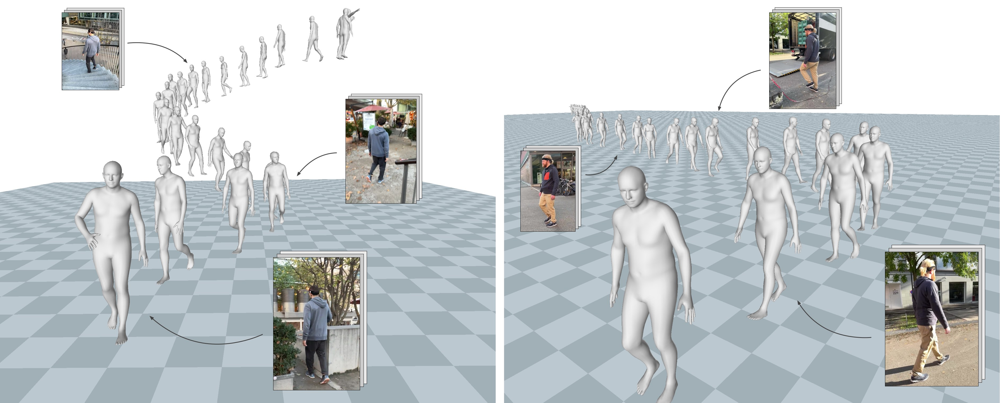

## TRAM
Code repository for the paper: \
**TRAM: Global Trajectory and Motion of 3D Humans from in-the-wild Videos**  
[Yufu Wang](https://yufu-wang.github.io), [Ziyun Wang](https://ziyunclaudewang.github.io/), [Lingjie Liu](https://lingjie0206.github.io/), [Kostas Daniilidis](https://www.cis.upenn.edu/~kostas/)\
[[Project Page](https://yufu-wang.github.io/tram4d/)]

## Updates
2024-03-25: We are working to release the code in the next few weeks. Thank you for your patience!  

